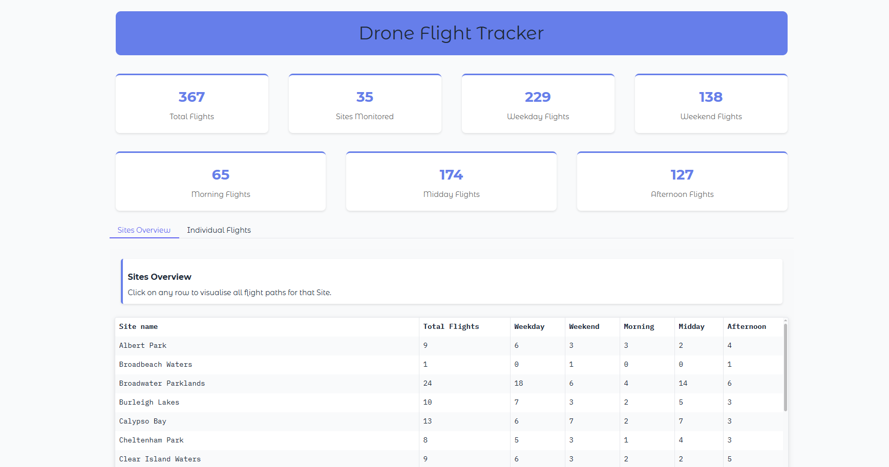
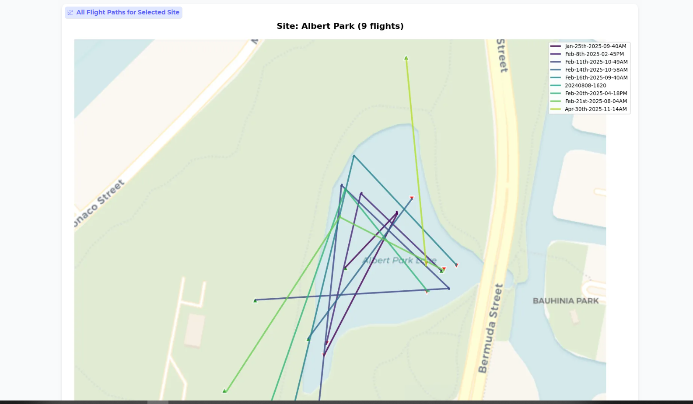
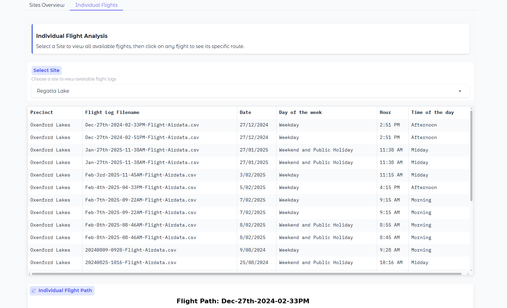
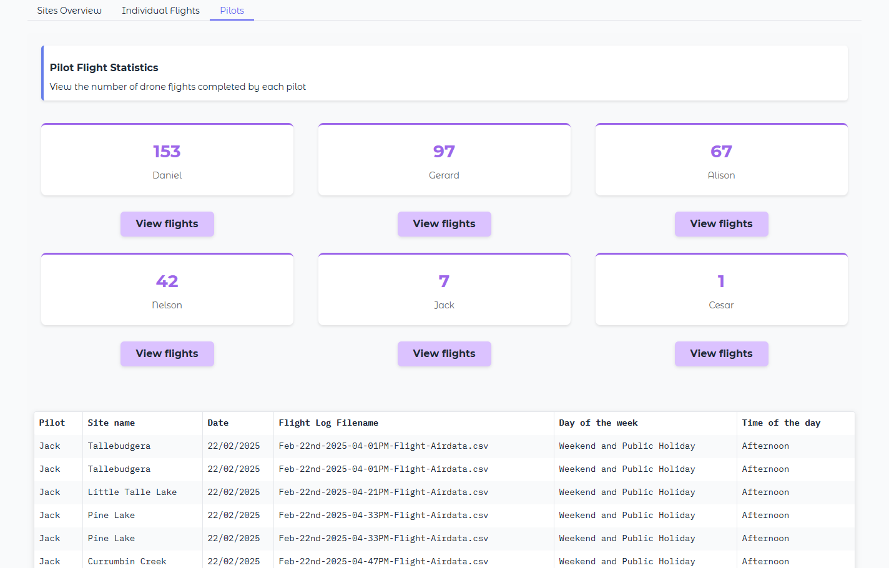

# Drone Flight Tracker
An interactive Gradio web app for visualising and analysing drone flight paths across different monitoring sites.

## Project Structure

```text
├── data/
│   ├── raw/
│   │   ├── flight-logs/                 # CSV logs of drone flights
│   │   └── metadata/                    # Metadata about each flight
│   └── tidy/                            # Cleaned/processed data
│
├── gradio/
│   ├── app.py                           # Main Gradio app
│   ├── styles.py                        # CSS and HTML templates
│   └── app-old-*.py                     # Previous versions
│
├── notebooks/                           # Analysis notebooks
├── scripts/                             # Utility scripts
├── requirements.txt                     # Python dependencies
└── README.md
```

## Installations
```bash
# Create virtual environment
python -m venv env
source env/bin/activate  # or .\env\Scripts\activate on Windows

# Install dependencies
pip install -r requirements.txt

```
## Data Requirements
Make sure the following files exist before running:
- `data/raw/flight-logs/*.csv` — flight logs with latitude/longitude/time
- `data/raw/metadata/waterways-merged-precinct-metadata-20250625.csv` — site metadata
    - Metadata CSV must contain: `Site name`, `Precinct`, `Day of the week`, `Hour`, `Time of the day`, `Date`, `Flight Log Filename` columns.

## Running the App
```bash
# Go to gradio dir
cd gradio
python3 app.py
```

The app will launch at `http://localhost:7860/` in your browser.

## Watch Demo Video
<video controls src="docs/vid/dashboard-drone.mp4" title="Watch Demo"></video>

## Dashboard


## Flight Paths:


## Individual Flights:


## Pilot Statistics:



